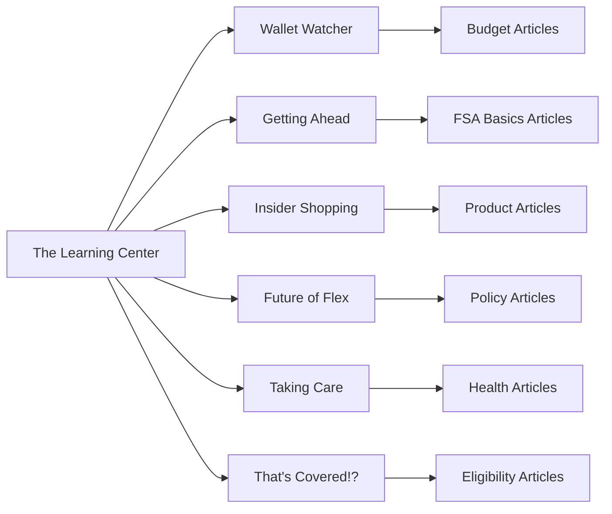

# Learning Center Page

## Purpose

This page is an educational content hub that helps users learn about FSA, HSA, and related healthcare spending topics.

## Page Summary

- URL: https://fsa.devhec.com/learning-center.html
- Page type: Educational content page
- Primary goal: guide users to helpful articles, explain key concepts, and connect them to eligibility and shopping topics.

## Main Page Structure

1. Shared site header and navigation
2. Hero section introducing the learning center
3. Topic category tiles
4. Featured articles and article carousel
5. Eligibility-related callout banner
6. Shared footer

## Key Content Areas

- The page is content-first and designed for education rather than transaction.
- Readers can browse topic categories and open articles that explain benefits, budgeting, taxes, and product eligibility.
- The page should support both general education and product discovery.

## Agent and LLM Notes

Use this document as the reference for learning and education-related user journeys. It should be treated as a knowledge and discovery page that supports broader FSA understanding.

## Related Knowledge

- Shared navigation: [navigation-menu.md](navigation-menu.md)
- Shared footer: [footer.md](footer.md)

page.locator('h2:has-text("Are your favorites FSA eligible?")')
page.locator('.c-main-banner\_\_link-element:has-text("See Eligibility List®")')

````

---

### 2.6 Popular Topics (3 Columns)

**Block:** `mobile-3r-1c`

| #   | Article Title                                  | Description                                                                      | URL                                                 |
| --- | ---------------------------------------------- | -------------------------------------------------------------------------------- | --------------------------------------------------- |
| 1   | **Why Isn't Insect Repellent FSA Eligible?**   | You didn't think we'd give you a problem without a solution, did you?            | `/articles/learn-insect-repellent-covered-fsa.html` |
| 2   | **Guide to Using Your FSA Card**               | Tips on how your card works, where it can be used, what it is not for, and more. | `/articles/learn-fsa-card.html`                     |
| 3   | **A Refresher Course on FSA Eligible Eyewear** | Everything you need to know about FSA eligible vision and optical expenses.      | `/articles/learn-fsa-eligible-eyewear.html`         |

#### Recommended Locators

```playwright
// Popular topic tiles
page.locator('h2:has-text("Why Isn\'t Insect Repellent FSA Eligible?")')
page.locator('h2:has-text("Guide to Using Your FSA Card")')
page.locator('h2:has-text("A Refresher Course on FSA Eligible Eyewear")')
````

---

### 2.7 Testimonial Section

**Block:** `c-main-banner` (no image)

| Element         | Content                                                                                                                                                                                      |
| --------------- | -------------------------------------------------------------------------------------------------------------------------------------------------------------------------------------------- |
| **Quote**       | "So easy to purchase and shipping was fast. I haven't taken advantage of all my FSA benefits and this has really helped tap into an unused resource. I've already recommended it to others." |
| **Attribution** | – Jerilyn                                                                                                                                                                                    |

#### Recommended Locators

```playwright
page.locator('.c-main-banner__body__content h2:has-text("So easy to purchase")')
page.locator('.c-main-banner__body__content__text p:has-text("Jerilyn")')
```

---

## Section 3: Email Signup (Home Page Style)

**Block:** `home-email-signup`

| Element        | Content                                                                                                                     |
| -------------- | --------------------------------------------------------------------------------------------------------------------------- |
| **Headline**   | Get $20 off your first $150 order                                                                                           |
| **Subtext**    | Sign up for discounts, special promotions, tips, and more!                                                                  |
| **Input**      | Email field with label "Enter Email Address"                                                                                |
| **Button**     | "Sign Up"                                                                                                                   |
| **Disclaimer** | By entering your email address, you agree to our Terms of Use and Privacy Notice, including Notice of Financial Incentives. |

#### Flow

```
Email Input → Validate → Submit → POST /EmailSubscribe-SubscribeEmail → Success
```

#### Recommended Locators

```playwright
// Email signup
page.locator('#hpEmailSignUp')
page.locator('.js-subscribeEmail:has-text("Sign Up")')
page.locator('.email-terms')
```

---

## Section 4: Site Footer

### 4.1 Footer Columns

**Block:** `c-site-footer__main-cols`

| Column               | Links                                                                                              |
| -------------------- | -------------------------------------------------------------------------------------------------- |
| **Customer Service** | FAQ, Contact Us, Shipping & Returns, FSA Eligible Guarantee                                        |
| **Resources**        | Savings Center, Learning Center, Eligibility List, FSA Advocacy, What is an FSA?                   |
| **Our Company**      | About Us, Awards & Press, Careers, Become a Partner                                                |
| **My Account**       | Manage My Account, Order Status, About FSA Perks, FSA Perks Dashboard, Sign Up for Deadline Alerts |

### 4.2 Help Section

**Block:** `c-site-footer__help`

| Action             | URL / Behavior                                                    |
| ------------------ | ----------------------------------------------------------------- |
| **Call**           | `tel:18883721450` (1-888-372-1450)                                |
| **FAQ**            | `https://help.fsastore.com/hc/en-us/categories/115000977647-FAQs` |
| **Contact Us**     | `/about-fsa-store-contactus.html`                                 |
| **Live Chat**      | `javascript:$zopim.livechat.window.show();`                       |
| **Shop HSA Store** | `http://hsastore.com`                                             |

### 4.3 Footer Features

| Feature           | Content                                                                                                                      |
| ----------------- | ---------------------------------------------------------------------------------------------------------------------------- |
| **Trust Badges**  | 100% Eligibility Guarantee, HiTrust, BBB, LegitScript                                                                        |
| **Payment Icons** | Mastercard, Visa, Amex, Discover                                                                                             |
| **Social Links**  | LinkedIn, Facebook, Twitter/X, Instagram                                                                                     |
| **Legal**         | Terms of Use, Privacy Notice, California Privacy Notice, Consumer Health Data Notice, Accessibility, Accessibility Statement |
| **TrustArc**      | Consent management (TrustArc)                                                                                                |

---

## Complete URL Map

### Learning Center Pages

```
/learning-center.html                          → Main Learning Center
/learning-wallet-watcher.html                  → Wallet Watcher category
/learning-getting-ahead.html                   → Getting Ahead category
/learning-insider-shopping.html                → Insider Shopping category
/learning-future-of-flex.html                  → Future of Flex category
/learning-taking-care.html                     → Taking Care category
/learning-thats-covered.html                   → That's Covered!? category
```

### Article Pages

```
/articles/learn-how-much-contribute-fsa.html   → How Much Should I Contribute?
/articles/learn-what-spf-should-i-use.html     → What SPF Should I Use?
/articles/learn-what-does-fsa-eligible-mean.html → What Does FSA Eligible Mean?
/articles/learn-sunglasses-fsa-eligible.html   → FSA Eligible Sunglasses
/articles/learn-covid-19-baby-boom-is-coming-fsa.html → Baby Products & FSA
/articles/learn-can-diapers-be-purchased-fsa.html → Are Diapers FSA Eligible?
/articles/learn-2021-travel-vaccine-what-you-need-to-know.html → Travel Vaccines
/articles/learn-fitness-expenses-fsa-eligible.html → Fitness Expenses
/articles/learn-can-use-fsa-card.html          → Using Your FSA Card
/articles/learn-fsa-skin-care-treatment.html   → Skincare FSA Eligibility
/articles/learn-insect-repellent-covered-fsa.html → Insect Repellent
/articles/learn-fsa-card.html                  → FSA Card Guide
/articles/learn-fsa-eligible-eyewear.html      → FSA Eligible Eyewear
```

---

## Page Metadata

```javascript
{
  "title": "FSA Learning Center | FSA Store | Salesforce Commerce Cloud | 6.1.0",
  "description": "The Learning Center offers resources to help you make the most of your FSA, including tips on investing, taxes, and other ways to elevate your healthcare.",
  "keywords": "FSA Store",
  "pageType": "Learning Center Page",
  "platform": "Salesforce Commerce Cloud (SFCC)",
  "pageId": "learning-center",
  "template": "pdStorePage",
  "canonical": "https://fsa.devhec.com/learning-center.html",
  "og:title": "FSA Learning Center | FSA Store",
  "og:type": "Site",
  "og:image": "/on/demandware.static/Sites-FSASTORE-Site/-/default/dw28867c13/images/Share-logo.jpg"
}
```

---

## Analytics & Tracking

| Platform           | ID/Key                                 |
| ------------------ | -------------------------------------- |
| Google Tag Manager | `GTM-K4TL22P`                          |
| Segment Analytics  | `poGF52EDWXhCFBTLNA1NQZKTUvVfUSbA`     |
| Constructor.io     | `key_kWFGqMuw8gvfhv87`                 |
| Bloomreach         | `https://analytics-api.devhec.com`     |
| AB Tasty           | `9ad5861e87506157d4a605e47b8e9de3`     |
| PowerReviews       | `ad2d0703-16cf-4778-b046-17fd4b8537c5` |
| Riskified          | `fsastore.com_hec_dev`                 |
| Zendesk            | `471b3c5d-bf07-4a04-af89-77cee1e02153` |

---

## Page Designer Components

### Component Registry

| Component                                      | Usage                                            |
| ---------------------------------------------- | ------------------------------------------------ |
| `experience-commerce_layouts-mobileGrid1r1c`   | Single column layouts (Hero, Full-width banners) |
| `experience-commerce_layouts-mobileGrid2r1c`   | Two column layout (Featured articles)            |
| `experience-commerce_layouts-mobileGrid3r1c`   | Three column layout (Popular topics)             |
| `experience-commerce_layouts-mobileGrid6r2c`   | Six column grid (Topics)                         |
| `experience-commerce_layouts-slickCarousel`    | Latest articles carousel                         |
| `experience-commerce_assets-mainBanner`        | Hero banners and article tiles                   |
| `experience-commerce_assets-popularCategory`   | Category tiles                                   |
| `experience-commerce_assets-editorialRichText` | Section headings                                 |

---

## Key Interactions

### 1. Article Navigation Flow

```
Category Click → Category Landing Page → Article Click → Article Detail Page
```

### 2. Carousel Interactions

```
Click Prev/Next → Slide Animation → New Articles Visible
```

### 3. Search Flow

```
Input → Autocomplete → Submit → Search Results
```

### 4. Email Signup Flow

```
Input Email → Submit → Validation → Success/Error
```

---

## Locator Reference (Playwright Selectors)

### Recommended Selectors

| Element            | Preferred Selector                                   | Fallback                                        |
| ------------------ | ---------------------------------------------------- | ----------------------------------------------- |
| Hero Heading       | `h1:has-text("The Learning Center")`                 | `.c-main-banner__short-banner__header__heading` |
| Topics Grid        | `.c-popular-category__container`                     | `[data-testid="popularCategory"]`               |
| Article Tile       | `.c-main-banner__wrapper`                            | `.mainbanner-container`                         |
| Carousel           | `.slick-carousel-tile`                               | `.js-slick-wrap`                                |
| Carousel Prev      | `.slick-prev`                                        | `button[aria-label="Previous"]`                 |
| Carousel Next      | `.slick-next`                                        | `button[aria-label="Next"]`                     |
| Read More          | `.c-main-banner__link-element:has-text("Read More")` | `.link:has-text("Read More")`                   |
| Eligibility Banner | `h2:has-text("Are your favorites FSA eligible?")`    | `.c-main-banner__body__content`                 |
| Testimonial        | `.c-main-banner__body__content__text p`              | `.c-main-banner__body__content`                 |
| Email Signup       | `#hpEmailSignUp`                                     | `input[name="hpEmailSignUp"]`                   |
| Footer             | `#footercontent`                                     | `footer`                                        |

---

## Content Types (SFCC)

### Content Assets Referenced

| Content ID                   | Purpose                                         |
| ---------------------------- | ----------------------------------------------- |
| `bbd886224cfc5b77db09e1d597` | Customer Service footer links                   |
| `3fe9ba78efb08095dc76fefffb` | Resources footer links                          |
| `fa13e6af46dbda1c71c39a38e1` | Our Company footer links                        |
| `bb01cb4fa15b9549df687646f6` | My Account footer links                         |
| `736001d4cb89775e17841135b1` | Help section                                    |
| `c2200f6ee02fb916a6f902b3c2` | Copyright notice                                |
| `c845dea0f5adfab0a62e8e07ae` | Utility menu links                              |
| `62817c33d9722e111cc282a66a` | Social links                                    |
| `2de7f306e2e953bf274ce0d071` | Login welcome message                           |
| `338ef50ebab68dd470b20bef9b` | User menu links (Buy It Again, FSA Perks, Help) |

---

## Knowledge Graph Summary

```
Learning Center Page
├── Type: Educational Content Hub
├── Platform: Salesforce Commerce Cloud
├── Industry: Healthcare / FSA Products
├── Content Categories (6):
│   ├── Wallet Watcher (Budget/FSA Management)
│   ├── Getting Ahead (FSA Basics)
│   ├── Insider Shopping (Product Recommendations)
│   ├── Future of Flex (Policy/Investing)
│   ├── Taking Care (Health/Wellness)
│   └── That's Covered!? (Eligibility/Trending)
├── Content Types:
│   ├── Articles (14+)
│   ├── Category Landing Pages (6)
│   └── Educational Content
└── Primary CTAs:
    ├── Read More (Articles)
    ├── See Eligibility List®
    └── Sign Up (Email)
```

---

## Section Relationships



---

## Page Flow for Test Automation

```
1. Navigate to /learning-center.html
2. Verify Hero heading "The Learning Center"
3. Verify 6 category tiles visible
4. Click a category tile → Verify navigation
5. Return to Learning Center
6. Scroll to Featured Articles → Click Read More → Verify article page
7. Return to Learning Center
8. Scroll to Carousel → Click Next/Prev → Verify slides change
9. Click article in carousel → Verify navigation
10. Scroll to Eligibility Banner → Click CTA → Verify Eligibility List page
11. Return to Learning Center
12. Scroll to Email Signup → Enter email → Submit → Verify success
```
