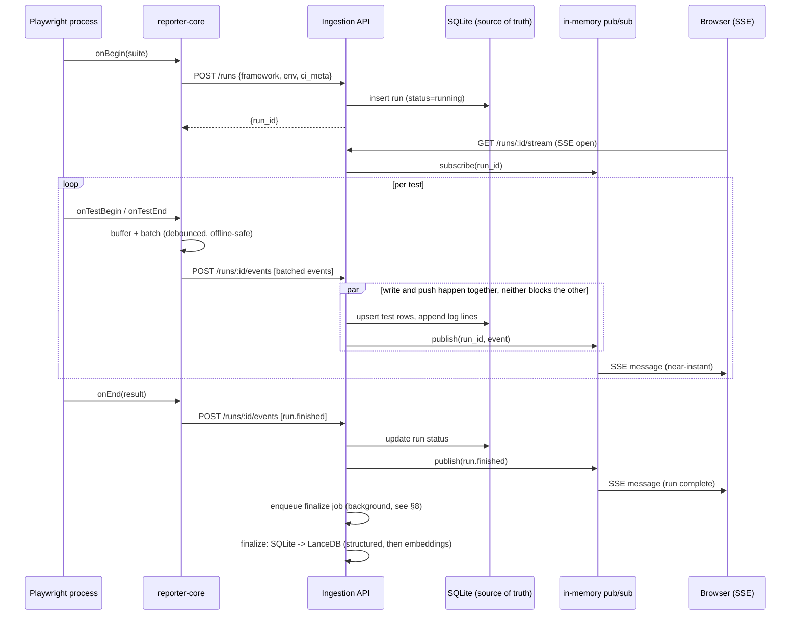
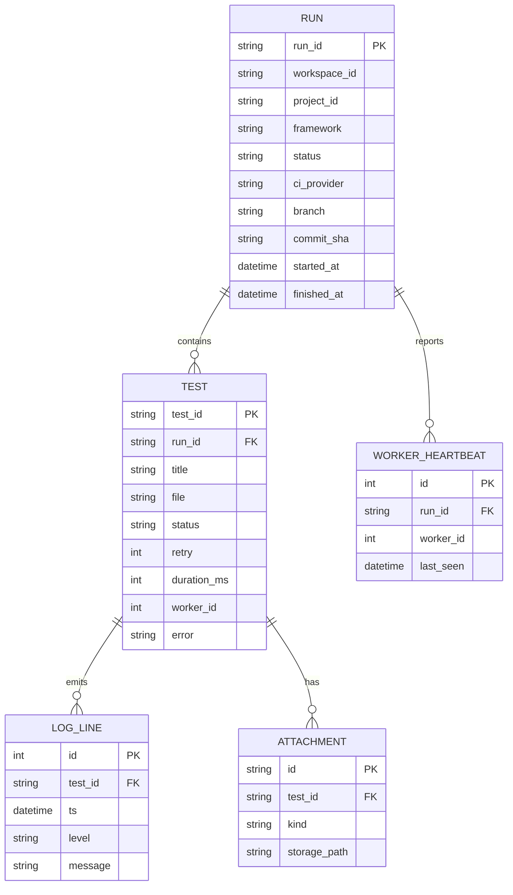

# Sentinel Live Execution — Architecture Review

**Author:** Staff architecture review · **Date:** 2026-07-23
**Scope:** Add real-time live test execution to Sentinel QA Analytics Dashboard, informed by patterns studied in `qarun` (not copied), with a bias toward radical deployment simplicity, low latency, and room to grow.

---

## 0. TL;DR

- **Keep Sentinel's core stack.** FastAPI + Next.js + LanceDB stay. No TiDB, no Postgres, no Kafka, no Docker-mandatory topology.
- **Storage decision (revised, see §6 for the full comparison): SQLite (WAL mode) is the source of truth for live runs; an in-memory pub/sub delivers updates to the browser instantly.** Not "either memory or a database" — both, doing different jobs. SQLite is a file, not a server — same operational tier as the `users.db` you already have.
- **LanceDB stays the only analytical database**, unchanged, fed once per run by a "finalize" step — not touched by live writes at all.
- **Push, don't poll, to the browser** — via SSE, not WebSocket. One-directional, HTTP-native, proxy-friendly, matches the actual data direction (server → browser only).
- **Live logs: yes. Live browser viewing: yes, opt-in.** Both are covered in detail in §7 — logs ride the same event stream; the browser view uses Chrome's built-in screencast protocol and is never persisted to any database.
- **One event schema, many adapters.** A single normalized event contract is the entire boundary between any test framework and the backend. Playwright ships first; Cypress/Selenium/Appium/JMeter/Robot Framework are adapters translating into the same schema, not backend rewrites.
- **AI never touches the live path.** Live writes go to SQLite; AI reads LanceDB. A single "finalize" step is the only bridge — this is what makes "AI can consume events without slowing live execution" true by construction, not by discipline.
- **This is a proven pattern, not a novel one.** It's the same shape as ReportPortal, Cypress Cloud/Currents, and BrowserStack Test Observability: agent → normalized event API → live fan-out → durable analytical store.

---

## 1. What each repository actually does today

### 1.1 `qarun` (studied for patterns only)

| Layer | Finding |
|---|---|
| Database | **TiDB Serverless** (MySQL-dialect, via Drizzle + `@tidbcloud/serverless`). Tables: `projects` (API key per project), `automation_builds`, `test_results` (one row per spec file, tests packed as a JSON array), `automation_live_frames` (ephemeral, overwritten ~1/sec, deleted at run end). |
| Reporter SDK | `dashboard-node-package` — a real Playwright `Reporter` implementation. `onBegin` creates a build over HTTP; `onTestBegin`/`onTestEnd` POST per-test status (fire-and-forget, non-blocking); `onEnd` flushes and PATCHes final build status. Auth via static `x-api-key`. Never throws into the test run — network failure just disables reporting for that process. |
| "Live" video | A separate mechanism entirely: a Playwright `globalSetup` connects to Chrome DevTools Protocol and polls `Page.captureScreenshot` every 50ms per worker, POSTing JPEG frames to a live-frame endpoint. Clever, but a distinct subsystem from test-status reporting — this is the pattern §7 below builds on. |
| Transport to browser | **No WebSocket, no SSE.** The "live" dashboard is 100% interval polling: build list every 15s, selected-build detail every 5s, expanded test logs every 2s, live video frames every 50ms. |
| Artifacts | Videos only, uploaded to Cloudinary via multipart POST; not stored in the DB. |
| Multi-tenancy | Full org → project → API-key hierarchy via Clerk auth. |
| CI awareness | Minimal — only checks `process.env.CI`, no per-CI-vendor branching. |

**Takeaway for Sentinel:** the *shape* is right (reporter SDK → generic event API → poll-or-push UI → finalize), but the specific choices (TiDB, per-test double-POST, polling-only transport, no offline buffering) are things to improve on, not inherit.

### 1.2 `sentinel-qa-analytics-dashboard` (the product being extended)

| Layer | Finding |
|---|---|
| Backend | FastAPI (`services/main.py`), single app, no routers mounted — `services/api_routes.py` is a **dead/unwired** `/api/*` surface, not the live contract. |
| Frontend | Next.js 16 + React 18, plain `fetch()` (despite docs claiming Axios — verified false in code), Bearer JWT + `x-workspace-id`/`x-project`/`x-ingestion-id` headers. |
| **Storage — corrected model** | **LanceDB is the actual primary durable store**, not a side vector index — `universal_ingester/core/storage.py` writes full structured test-result tables (`structured_test_results`, with `flattened_tests` kept as a legacy fallback name) into Lance, plus a `documents` table of embedded chunks for semantic search, chat memory, and chart history. **DuckDB is ephemeral**: re-registered from LanceDB tables on every process start/load, holds nothing durable itself. SQLite (`users.db`) currently only holds auth. |
| Ingestion | `universal_ingester/` — connector (Allure / file / DB / API) → schema-detect → dedup-write into Lance → link into DuckDB. Triggered by CLI or `POST /ingest/config2` (background task). **Batch-only**: point it at a finished report and it ingests one build. No file-watch, no in-progress-run append. |
| Playwright integration | **None exists.** No reporter, no Playwright-JSON connector. Today's only path for any framework is: run → produce a report file → ingest that file after the fact. |
| Real-time mechanism | **None.** No WebSocket/SSE anywhere. Only client polling: dashboard overview every 20s, ingestion-status polling for background jobs. This is the actual gap live execution needs to fill. |
| AI | LiteLLM-backed (Gemini/OpenAI/Anthropic/Ollama pluggable). Reads DuckDB (structured, materialized from Lance at load) for SQL/stats and LanceDB directly for vector search. Both are **snapshots taken at ingestion time** — nothing today re-registers tables mid-run, which is exactly why live writes must not go through this path unmodified. |
| Deployment | No Dockerfile, no k8s. Manual single-VM: Python venv + `uvicorn`/`python -m services.main` + `npm start`. `.env` in plaintext. This *is* the "sell as a simple VM install" constraint being designed for. |
| Multi-tenancy | Partial — `workspace_id` scopes chat/chart/feedback, but ingested test data is scoped only by `ingestion_id`, globally listable. Worth closing when the live-run schema is introduced (give it `workspace_id` from day one). |

**Documentation corrections worth fixing alongside this work:** CLAUDE.md/SIMPLE_ARCHITECTURE.md describe an Axios API layer and imply DuckDB durably stores tables — neither is true; DuckDB is rebuilt from LanceDB on every load.

---

## 2. Runtime comparison

| Concern | qarun | Sentinel today | Sentinel — live execution target |
|---|---|---|---|
| Structured DB | TiDB (distributed SQL, cloud or self-hosted cluster) | LanceDB (embedded, columnar) + SQLite (auth only) | LanceDB (cold/analytical, unchanged) + SQLite (hot/live, new) |
| Live transport | Polling only (2s–50ms intervals) | None | SSE push, polling fallback |
| Reporter | Playwright-specific, hand-rolled | None | Framework-agnostic core + thin adapters |
| Live browser view | Yes — CDP screencast, polling-delivered | None | Yes — CDP screencast, SSE-delivered, opt-in per worker |
| Artifact storage | Cloudinary (SaaS) | N/A today | Local disk by default, pluggable blob store (S3/MinIO) for scale |
| Deployment unit | Next.js app + TiDB Cloud + Cloudinary | Single VM, two processes | Single VM, two processes (unchanged) + one optional background worker |

---

## 3. How enterprise platforms actually do this

The pattern is consistent across the category (Cypress Cloud/Currents.dev, BrowserStack Test Observability, CircleCI/GH Actions live logs, and — closest open-source analog — **ReportPortal**):

1. A thin **agent/reporter** per framework translates native lifecycle hooks into a **normalized event schema**.
2. Events are pushed over plain HTTP to a **generic ingestion API** — the backend never has framework-specific ingestion code.
3. The backend holds **in-progress run state in a fast mutable store** and **fans out to connected clients** over a push channel.
4. On completion, the run is **finalized/promoted into an analytical store** used for history, trends, and AI.

This isn't a novel design — it's the industry-standard shape, sized to Sentinel's "must run on one VM" constraint.

---

## 4. Recommended architecture

```mermaid
flowchart TB
    subgraph Client-Side Execution
        PW["Playwright test run"] -->|"lifecycle hooks"| SDK["@sentinel/playwright adapter"]
        SDK --> CORE["@sentinel/reporter-core\n(batching, retry, offline buffer)"]
        SDK -.->|"optional, opt-in"| SCREEN["CDP screencast\n(per worker)"]
    end

    CORE -->|"HTTPS POST /api/v1/runs/*\nnormalized events, batched"| API
    SCREEN -.->|"HTTPS POST /runs/:id/live-frame\n(only when watched)"| API

    subgraph Sentinel Backend (single FastAPI process)
        API["Ingestion API"] --> HOT[("SQLite — WAL mode\nsource of truth for live runs")]
        API --> FRAME["Latest-frame cache\n(in memory, per worker,\nnever persisted)"]
        HOT --> BUS["In-process pub/sub\n(per run_id)"]
        FRAME --> BUS
        BUS --> SSE["SSE endpoint\n/runs/:id/stream"]
        HOT -->|"on run finish"| FIN["Finalize job\n(background task)"]
        FIN -->|"1. structured rows\n(no embedding needed)"| COLD[("LanceDB\nstructured_test_results")]
        FIN -->|"2. text -> embeddings\n(async, slightly delayed)"| DOCS[("LanceDB\ndocuments (RAG)")]
        COLD --> AI["AI / RAG service"]
        DOCS --> AI
        COLD --> SERVE["Existing serving API\n(dashboard, chat, chart)"]
    end

    SSE -->|"push"| UI["Next.js live run view\n(status, logs, screenshots, live browser)"]
    SERVE -->|"fetch"| UI2["Next.js history/analytics view"]
```

---

## 5. TiDB: replace, don't adopt

TiDB is a distributed HTAP database built for horizontal write scale across many nodes and petabyte datasets. That's not Sentinel's problem: even a large customer running thousands of parallel workers across many CI jobs is a workload of small, fast, mostly-key-based writes — well within what a single embedded database handles.

Adopting TiDB would mean either paying for TiDB Cloud (external SaaS dependency, contradicting "as simple as a folder on a VM") or self-hosting PD + TiKV + TiDB nodes (three clustered services for what is, at Sentinel's scale, a single-writer workload). Neither serves the sales story.

**Recommendation:** don't use TiDB anywhere in Sentinel. If a specific future customer genuinely needs multi-node horizontal write scale, the upgrade path is a managed Postgres, decided from production metrics — not built speculatively now.

---

## 6. Storage architecture — the decision, compared honestly

Two real options were weighed for the *live* (hot) layer. Both keep LanceDB as the only analytical database — the question is only about in-progress run state.

| Criteria | **Option A** — memory + hand-rolled log file | **Option B** — SQLite (WAL) as source of truth + in-memory pub/sub for delivery |
|---|---|---|
| Live-push latency | RAM-speed (lowest possible) | **Identical.** The pub/sub still fires straight from memory the instant a write happens; the SQLite write (sub-millisecond to a few ms) happens alongside it, not in front of it. The browser never waits on SQLite. |
| Crash recovery | Must hand-build log replay: line-corruption handling, idempotent re-apply, partial-write recovery — real engineering effort to get *right* | SQLite's WAL is a mature, decades-battle-tested crash-recovery mechanism. Nothing to invent. |
| Extending later (new features) | Every new "look across live runs" feature needs bespoke in-memory indexing code | Plain SQL. "Show every currently-failing test org-wide," filters, search — just queries against a table that already exists |
| Multiple processes on one machine | Breaks — each process has its own memory, they can't see each other's runs | Works — WAL mode is explicitly designed for multiple processes safely sharing one file |
| Big data (many concurrent runs, high test counts, longer retention of "recently live" state) | Bounded by RAM; realistic per-run footprint is small (KBs), but grows **unbounded** without manual eviction code you have to write and maintain | Bounded by disk, not RAM — scales to far more concurrent runs and history without custom eviction logic |
| True horizontal (multi-machine) scale | Breaks | Also breaks — SQLite is a local file. **Both options hit this same wall eventually**, and both are solved the same way later: swap for Postgres behind the same interface. This is not a reason to prefer A over B. |
| Operational footprint | Framed as "not a database" — but functionally *is* one, just hand-built and far less tested | A single file. No server process, no port, no credentials, ships in Python's standard library — the exact same simplicity tier as the `users.db` already in this codebase |

### Verdict: **Option B.** SQLite (WAL) is the source of truth; in-memory pub/sub is purely the delivery mechanism.

This resolves the tension in the earlier question entirely — it isn't "fast xor durable/extensible," it's both, because they're two different jobs happening in parallel on the same write, not two competing paths. The in-memory pub/sub is what makes it feel instant; SQLite is what makes it survivable, queryable, and able to grow with the product. And critically: this is **not** "one more database to manage" in the sense you were worried about (that concern applies to TiDB/Postgres/a server process) — it's a file, exactly like the LanceDB folders and `users.db` you already operate today.

**Cons, stated plainly:**
- More to build upfront than "just memory" — a schema, WAL configuration, a `busy_timeout` setting to avoid "database is locked" errors under concurrent writers. This is well-documented, common SQLite territory, not a novel risk — but it is real setup work, not zero.
- Still doesn't span multiple machines. If Sentinel ever becomes a horizontally-scaled multi-instance SaaS, this layer moves to Postgres + Redis pub/sub. Not a near-term concern for a single-VM-per-customer sale, and the module boundary (`services/ingestion/store.py`, `services/live/bus.py`) is drawn specifically so that's a swap, not a rewrite, if that day comes (see §16).

**Cold layer — LanceDB, unchanged role.** Everything about *finished* runs — structured tables plus embeddings for semantic/RAG search. This is exactly what LanceDB is good at: batch/append-heavy analytical writes, not high-frequency single-row mutation. Live events must never be written here directly — Lance's fragment/compaction model degrades under continuous small writes from an in-progress run. Routing live writes through SQLite and finalizing into Lance once (at run completion, or on periodic checkpoint for very long runs) keeps both stores doing only what they're good at.

**Artifacts (screenshots/video/traces):** local disk under a per-run directory by default (`data/runs/<run_id>/attachments/…`), with a pluggable storage interface so a customer can point it at S3/MinIO/Azure Blob without code changes. Never store binary blobs in SQLite or Lance.

---

## 7. Live logs and live browser viewing

Both are supported. They work differently because they're different kinds of data.

### 7.1 Live test logs — yes, straightforward

Every log line, console output, and status change a test produces is already part of the normalized event stream (§9) flowing through SQLite → pub/sub → SSE. The live run page just renders these as they arrive — this is the same mechanism as the status updates, no separate system needed. Nothing new to explain beyond §6/§9 — it falls out of the design for free.

### 7.2 Live browser viewing — yes, opt-in, and here's exactly how it works

Chrome (and Chromium, which Playwright drives) exposes **CDP — Chrome DevTools Protocol**, the same technology behind Chrome's own DevTools panel. One CDP capability is `Page.startScreencast`: tell it once, and Chrome pushes a small JPEG frame every time the page visibly changes, automatically throttled — you don't poll for frames, Chrome sends them. Playwright already exposes a hook to open this (`page.context().newCDPSession(page)`), so this is a supported, documented capability, not a hack. It works in **headless mode too** — no monitor needed, which is why this works identically in CI.

**Flow:** reporter opens a CDP session on the page currently running a test → starts the screencast → each frame gets forwarded to the backend (`POST /runs/:id/live-frame`, tagged by worker) → the backend keeps **only the latest frame per worker, in memory, overwritten on arrival** → pushed down the same SSE channel → the frontend swaps an `` tag's contents on each arrival, which reads as a low-frame-rate live video.

**Deliberately never touches SQLite or LanceDB.** Frames are high-frequency and worthless once superseded — persisting them would be pure waste and is exactly the kind of high-frequency-small-write workload SQLite and LanceDB both handle worse than "just keep the latest one in a variable." This is the same reason qarun's `automation_live_frames` table is designed to be overwritten and swept, just implemented without a database at all here since there's genuinely nothing worth keeping.

**Cost-aware by design:** streaming frames costs real CPU/bandwidth, so it's **off unless someone clicks "Watch Live"** on a specific worker — most CI runs finish with nobody watching, and this way they pay zero cost for a capability nobody used. This mirrors qarun's CI-only default, made stricter (per-worker opt-in, not blanket-on).

---

## 8. Finalize pipeline — parsing and embedding into LanceDB, explained

This directly answers "does Sentinel need to parse and embed data before storing in LanceDB" — the answer is **yes, but only half of it, and it's simpler than what the ingestion pipeline does today.**

LanceDB holds two different kinds of tables today, and they're written differently:

1. **`structured_test_results`** (a.k.a. `flattened_tests`, legacy name) — plain typed columns: test title, status, duration, file, etc. **No embedding involved.** This is just a table write, like inserting a row into a spreadsheet.
2. **`documents`** — chunks of text (error messages, log excerpts, descriptions) run through an embedding model so LanceDB can do semantic/vector search for AI chat ("find failures related to timeout errors"). **This one does require embedding** — text goes in, a vector comes out, both get stored.

Today, `universal_ingester`'s Allure connector has to do real parsing work because Allure JSON is a loosely-structured format it has to interpret and guess field meanings from. **Live-executed runs skip that problem entirely** — the reporter already sends clean, pre-typed data (the normalized event schema *is* the structure), so mapping SQLite rows into `structured_test_results` columns is a direct, well-typed transform, not a generic parser. This is strictly simpler than what the pipeline already does for Allure.

**What the finalize job actually does, in order, when a run ends:**

1. Read all rows for `run_id` from SQLite.
2. Map them directly into `structured_test_results` rows (no parsing ambiguity, no embedding) and batch-write into LanceDB. **Fast** — this is what makes the run's structured report/history/analytics available immediately.
3. Mark the run as a finished, browsable historical report.
4. **Separately, as a background step that doesn't block step 3:** take the text-bearing fields (error messages, failure context, test titles) from the same run, chunk them, call the embedding model (via the existing `llm_client`/LiteLLM setup — no new embedding logic needs to be built), and write into the `documents` table.

Step 4 finishing a few seconds after step 3 is an acceptable, unnoticed delay — nobody asks the AI chat about a run in the same millisecond it finishes. This ordering is exactly what makes "AI can consume events after runs finish without slowing live execution" concretely true: the expensive step (embedding) is not only after the run, it's after the report is already visible.

**No new embedding logic is invented for this** — the finalize job calls the exact same write functions `universal_ingester/core/storage.py` already exposes; it's a new *caller*, not new *capability*.

---

## 9. Event flow



Two deliberate improvements over the qarun pattern this was informed by: events are **batched** (one POST can carry many test/log events, not two guaranteed round-trips per test), and the reporter maintains a **local offline buffer** (ndjson on disk) so a network blip never loses data or blocks the test run; a `sentinel flush` CLI can replay a buffered run later.

---

## 10. Runtime sequence (CI vs local — same code path)

Both environments hit the identical ingestion API; the only difference is what metadata the adapter auto-detects and attaches to `POST /runs`:

- **Local:** `ci: false`, machine hostname, git branch/commit if available.
- **GitHub Actions:** `GITHUB_ACTIONS`, `GITHUB_RUN_ID`, `GITHUB_SHA`, build a permalink to the run.
- **Jenkins:** `JENKINS_URL`, `BUILD_URL`, `BUILD_NUMBER`.
- **Azure DevOps:** `TF_BUILD`, `BUILD_BUILDID`.
- **Bitbucket Pipelines:** `BITBUCKET_BUILD_NUMBER`, `BITBUCKET_COMMIT`.
- **Docker:** no special-casing — it's "local" from the container's point of view; the only requirement is the ingestion URL being reachable via `SENTINEL_BASE_URL`.

This is a strict superset of qarun's `process.env.CI`-only check, and it's what makes "no manual upload, just add the reporter" true across every environment, not just locally.

---

## 11. Reporter SDK architecture

```
@sentinel/reporter-core        ← framework-agnostic engine (published, but not installed directly by users)
  - event schema + validation
  - HTTP client (batching, retry w/ backoff, gzip)
  - offline buffer (ndjson spill-to-disk)
  - CI/env auto-detection
  - config resolution (env vars > config file > reporter options)
  - optional CDP screencast module (§7.2), only active when a worker is being watched

@sentinel/playwright           ← thin adapter, implements Playwright's Reporter interface
  - onBegin/onTestBegin/onTestEnd/onEnd -> core.emit(normalizedEvent)
  - attachment collection (screenshot/video/trace paths -> upload queue)

@sentinel/cypress   (future)   ← Cypress plugin + reporter, same translation into core
@sentinel/selenium  (future)   ← listener (Java/Python bindings) posting to the same API
@sentinel/appium    (future)   ← same event model, mobile-specific metadata fields
@sentinel/jmeter    (future)   ← JMeter backend listener plugin (JVM), talks HTTP to the same API
@sentinel/robot     (future)   ← Robot Framework listener API implementation
```

**The contract that makes "no major redesign" true:** every adapter emits the same `SentinelExecutionEvent` union regardless of source framework. The backend has exactly one ingestion code path for all frameworks; adding a framework means writing an adapter, never touching `ingestion/`, `live/`, or `finalize/`.

**User-facing config**, matching the requested "minimal config" UX:

```ts
// playwright.config.ts
export default defineConfig({
  reporter: [['@sentinel/playwright', { projectId: 'proj_abc', apiKey: process.env.SENTINEL_API_KEY }]],
});
```

`baseUrl` defaults from `SENTINEL_BASE_URL`; everything else is optional and auto-detected.

**Fail-safe behavior, kept from qarun's design (it's genuinely good):** the reporter never throws into the test run. A dead network disables reporting for that process and buffers to disk instead of blocking `playwright test`.

---

## 12. Backend architecture

Stays a **modular monolith** — one FastAPI process, matching the current single-VM deployment — with clean internal module boundaries so any piece can be pulled into its own process later without a rewrite:

```
services/
  ingestion/        # NEW — event intake, validation, SQLite writes (hot layer)
  live/              # NEW — pub/sub, SSE fan-out, live-frame cache (screencast), run-state cache
  finalize/          # NEW — background job: SQLite run -> LanceDB (structured, then embeddings — see §8)
  serving/           # EXISTING services/main.py content, reorganized
  ai/                # EXTRACTED from inline services/ code (llm_client, rag_service)
universal_ingester/  # UNCHANGED — remains the batch/file-based ingestion path,
                     # writes into the same Lance schema `finalize/` targets
```

`universal_ingester` is deliberately left as-is and kept as a *parallel* entry point into the same Lance schema — a team without a reporter installed yet can still `ingest` an Allure/JUnit dump post-hoc, and both paths converge on identical downstream data.

**Scaling boundary (not day one):** SSE fan-out via in-process pub/sub only works correctly with one backend process. If Sentinel ever needs multiple backend instances behind a load balancer, swap the in-process bus for **Redis Streams** (still a single small binary, still trivial to run on the same VM) and SQLite for Postgres — the only point in the whole design where a queue/server shows up, and only when horizontal scaling is actually needed. See §16.

---

## 13. Frontend architecture

Add one new route family alongside the existing dashboard, not a rewrite:

- `app/runs/[runId]/live/page.tsx` — new. Opens an `EventSource` against `/api/v1/runs/:id/stream`, renders running/passed/failed/skipped counts, per-test rows with live status transitions, worker panel, timeline, a log/console pane that appends as events arrive, and a **"Watch Live" toggle per worker** that renders the CDP screencast frames as they arrive (§7.2). Falls back to polling `GET /runs/:id` at 3–5s if `EventSource` isn't available.
- `app/runs/[runId]/page.tsx` — the same run, once finished, renders from the finalized (Lance-backed) data — indistinguishable from any other historical report.
- Existing `app/dashboard/page.tsx` and `app/build-trends/page.tsx` are untouched; a live run simply becomes another data point once finalized.
- Reuse existing chart libraries already in the project (ApexCharts/Recharts) for the live timeline rather than adding a fourth.

---

## 14. Folder structure (proposed)

```
sentinel-qa-analytics-dashboard/
  services/
    ingestion/
      api.py            # POST /runs, POST /runs/:id/events, POST /runs/:id/attachments
      schema.py          # SentinelExecutionEvent pydantic models (shared source of truth)
      store.py            # SQLite access (WAL mode, migrations via alembic or raw SQL)
    live/
      bus.py              # per-run_id in-process pub/sub (asyncio.Queue), swappable for Redis
      sse.py               # GET /runs/:id/stream
      screencast.py         # in-memory latest-frame cache per (run_id, worker_id), never persisted
    finalize/
      job.py                # SQLite -> LanceDB structured write, then async embeddings (see §8)
    ai/                       # extracted from inline services/ code
    serving/                   # existing main.py content, split into routers
  universal_ingester/          # unchanged
  frontend/
    app/runs/[runId]/live/     # new live view (logs, status, live browser toggle)
    app/runs/[runId]/          # finished-run view (existing report UI, reused)
  packages/                    # NEW — SDK monorepo, versioned/published independently
    reporter-core/
    playwright/
    (cypress/, selenium/, ... added later, same shape)
```

---

## 15. API design

| Method | Path | Purpose |
|---|---|---|
| `POST` | `/api/v1/runs` | Create a run (`onBegin`). Body: framework, env, CI metadata, worker count. Returns `run_id`. |
| `PATCH` | `/api/v1/runs/{run_id}` | Update run status (`onEnd`) — `passed`/`failed`/`cancelled`. |
| `POST` | `/api/v1/runs/{run_id}/events` | **Batched** event ingestion — array of `SentinelExecutionEvent`. Single endpoint for test start/end, logs, retries, heartbeats. |
| `POST` | `/api/v1/runs/{run_id}/attachments` | Multipart upload (screenshot/video/trace), streamed to disk/blob store, returns a pointer stored on the event. |
| `POST` | `/api/v1/runs/{run_id}/live-frame` | Latest CDP screencast frame for a worker (§7.2) — overwrite-only, in-memory, never queried historically. |
| `GET` | `/api/v1/runs/{run_id}/stream` | SSE — live event stream for one run (status, logs, frames). |
| `GET` | `/api/v1/runs/{run_id}` | Snapshot (initial load / polling fallback). |
| `GET` | `/api/v1/runs` | History/list, filterable by workspace/project/status — reuses existing `x-workspace-id` scoping. |

**Auth:** reuse Sentinel's existing per-project header pattern, not a new scheme.

**Normalized event schema** (the entire cross-framework contract):

```json
{
  "event_type": "test.started | test.finished | test.log | test.attachment | worker.heartbeat | run.finished",
  "run_id": "run_abc123",
  "ts": "2026-07-23T10:15:32.104Z",
  "worker_id": 2,
  "test": {
    "id": "spec.ts::should login",
    "title": "should login",
    "file": "auth/login.spec.ts",
    "status": "running | passed | failed | skipped | retried",
    "duration_ms": 1240,
    "retry": 0,
    "error": null
  },
  "payload": { "...": "event-type-specific data (log line, attachment ref, etc.)" }
}
```

---

## 16. WebSocket/event design

**Decision: SSE for browser push, plain HTTP for reporter → backend ingestion. No WebSocket anywhere.**

- Data only flows one direction to the browser; WebSocket's bidirectionality buys nothing here.
- SSE rides plain HTTP/1.1+, so it survives corporate proxies and load balancers that mishandle the WS upgrade handshake — a real concern for an on-prem/VM-sold product whose customers' networks you don't control.
- Browsers auto-reconnect `EventSource` natively; WebSocket reconnection is hand-rolled.
- FastAPI support is a small `StreamingResponse`/`sse-starlette` addition, not new infrastructure.
- Reporter → backend was never a socket either way — plain batched HTTP POST, with the offline buffer covering disconnects.
- Live-frame data (§7.2) rides the **same** SSE channel as everything else — no second transport needed, just a different `event_type`.

---

## 17. Database design



This lives entirely in SQLite (§6). Deliberately: **one row per test**, not a JSON blob per spec file (which made partial updates and locking awkward in qarun's `test_results` table), and a proper `log_line`/`worker_heartbeat` table. Live-frame data (§7.2) intentionally has **no table** — it's memory-only, since nothing is gained by persisting a value that's about to be overwritten in under a second.

On finalize, `RUN`/`TEST` map directly onto `structured_test_results` in LanceDB (§8) — a translation, not new modeling work.

---

## 18. Problems and solutions

| Problem | Solution |
|---|---|
| Writing live events straight into LanceDB would fragment/degrade it | Route through SQLite; finalize batches into Lance exactly once per run (§6, §8) |
| Backend process crashes mid-run | SQLite's WAL is crash-safe by design — no custom recovery code, the run's state survives the restart |
| Multiple people watching the same run at once | Pub/sub is fan-out by nature — one event, many subscribers, no added cost per extra viewer |
| Test runner loses network mid-suite | Reporter buffers events to local disk (ndjson) and retries with backoff; never fails the test run; `sentinel flush` replays later |
| CI runner can't reach the Sentinel backend at all | Same offline buffer; the run still lands in history once flushed, just wasn't "live" for that execution |
| AI queries competing with live writes for resources | Structurally impossible — AI reads LanceDB, live writes go to SQLite; different files, different I/O paths, no shared lock |
| Live browser viewing costs CPU/bandwidth | Off by default, opt-in per worker (§7.2) — cost is only paid when someone actually clicks "Watch Live" |
| Adding a new framework (Cypress, Selenium, ...) | Zero backend changes — new frameworks are new adapters emitting the same normalized event schema (§11) |
| Growing beyond one VM/process later | Clean module boundaries (`ingestion/store.py`, `live/bus.py`) make SQLite→Postgres and in-process pub/sub→Redis a configuration swap, not a rewrite (§16) |
| Long-running (soak/perf) test runs | Finalize periodically on a checkpoint, not only at `run.finished`, so history/AI aren't blocked on a run that takes hours |

---

## 19. Scalability and "big data" considerations

Three layers scale independently — this matters because "big" means different things at each:

- **Live layer (SQLite, WAL mode):** the write pattern is many small, fast, mostly-key-based writes — test status flips, log lines, heartbeats. WAL mode comfortably handles this at volumes far beyond what even a large customer's parallel worker fleet produces; this is not the bottleneck for any realistic Sentinel deployment size. Vertical scaling (a bigger VM) covers the overwhelming majority of customers.
- **Historical/analytical layer (LanceDB):** unchanged, and this is genuinely where "big data" already lives — millions of historical test rows, growing embeddings corpus. LanceDB already scales for this; nothing about live execution changes that story.
- **Live-frame data (§7.2):** deliberately never accumulates — latest-only, in memory, so it can never become a "big data" problem by construction.
- **The one real scaling seam:** SSE fan-out and SQLite both assume a single backend process/machine. That's the trigger — not before — to move to Redis Streams (pub/sub) + Postgres (source of truth), swapped in behind the same module interfaces. This is a real future step for a multi-instance, multi-region SaaS version of Sentinel — not a near-term concern for a single-VM-per-customer sale.
- **Multi-tenancy:** give the new `run`/`test` tables `workspace_id` from day one (closing the partial-multi-tenancy gap noted in §1.2) rather than retrofitting it later.
- **Don't reach for Postgres/TiDB until metrics say so.** The upgrade path exists and is cheap to take *later* because the module boundary is drawn correctly *now* — that's the actual scalability strategy here, not pre-building for scale that may never arrive.

---

## 20. Migration plan (additive, non-destructive)

Every phase ships without touching or breaking the existing ingestion/serving path — old and new run side by side until the reporter SDK is the default.

1. **Phase 0 — no-op baseline.** Existing Allure/file-based `universal_ingester` flow keeps working exactly as today.
2. **Phase 1 — hot storage + ingestion API.** Add SQLite schema, `services/ingestion/`, `services/live/`. Pure backend addition; nothing existing changes.
3. **Phase 2 — SDK.** Build `@sentinel/reporter-core` + `@sentinel/playwright`, publish to npm (private registry first if preferred).
4. **Phase 3 — live UI.** New `/runs/[runId]/live` route (status + logs first). Existing dashboard/build-trends routes untouched.
5. **Phase 4 — finalize job.** Connect SQLite → LanceDB via `services/finalize/`, reusing `universal_ingester.core.storage` write path (§8). Live-executed runs start appearing in existing history/analytics views for free.
6. **Phase 5 — live browser viewing.** Add the CDP screencast module (§7.2) as an opt-in add-on — deliberately after the core live experience is proven, since it's the highest-cost, lowest-necessity piece.
7. **Phase 6 — AI hook.** Post-finalize event triggers insight generation (e.g., flaky-test detection) — purely additive to the existing AI module.
8. **Phase 7 — additional adapters.** Cypress, then Selenium/Appium/JMeter/Robot Framework, each a new package under `packages/`, zero backend changes required.
9. **Housekeeping (any time):** correct CLAUDE.md/SIMPLE_ARCHITECTURE.md's Axios/DuckDB claims; decide the fate of the dead `services/api_routes.py`.

---

## 21. Step-by-step implementation roadmap

1. Define `SentinelExecutionEvent` schema (pydantic + TypeScript mirror) — the single source of truth both SDK and backend build against.
2. Stand up SQLite schema (§17) + `busy_timeout`/WAL configuration; implement `services/ingestion/store.py`.
3. Implement `POST /runs`, `POST /runs/:id/events` (batched), `PATCH /runs/:id`.
4. Implement in-process pub/sub (`services/live/bus.py`) + `GET /runs/:id/stream` (SSE) — writes to SQLite and publishes to the bus happen together, neither blocking the other (§9).
5. Build `@sentinel/reporter-core`: HTTP client with batching/backoff, offline ndjson buffer, CI-env auto-detection.
6. Build `@sentinel/playwright` adapter on top of core; validate against a real multi-worker sharded suite locally.
7. Build the live run frontend view consuming the SSE stream (status + logs first), with polling fallback.
8. Implement attachment upload endpoint + local-disk storage adapter (interface ready for S3/MinIO later).
9. Implement `services/finalize/job.py`: structured write first (fast, unblocks the report view), embeddings second (async, §8). Verify a live-executed run shows up identically to a file-ingested one in existing dashboard/build-trends views.
10. Dogfood locally + in one real CI provider (start with GitHub Actions).
11. Add remaining CI-vendor metadata detection (Jenkins, Azure DevOps, Bitbucket).
12. **Add live browser viewing** (§7.2): CDP screencast module in the reporter, `live-frame` endpoint, in-memory latest-frame cache, "Watch Live" toggle in the UI — opt-in, off by default.
13. Wire the AI post-finalize hook (flaky-test detection is a natural first insight, given the retry/status data already captured).
14. Load-test SQLite under realistic parallel-worker counts; confirm WAL-mode behavior matches expectations before calling this production-ready.
15. Document the reporter SDK for customers (`README`, minimal-config example matching §11); publish `@sentinel/playwright`.
16. Only then: revisit whether Redis + Postgres are needed, based on actual multi-instance deployment requirements — not before (§19).
