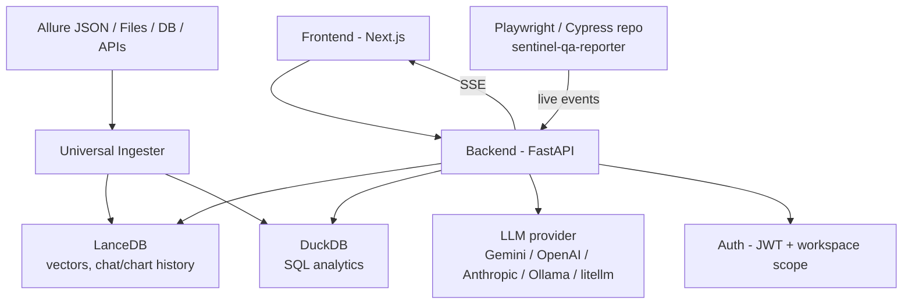

# Architecture Guide

The technical deep-dive: how TR-Insight is actually built, for anyone who needs to modify it rather than just run it. For "how do I start this" see [`02-getting-started.md`](02-getting-started.md); for "how do I use the dashboard" see [`07-user-guide.md`](07-user-guide.md).



## Backend (`services/`, Python/FastAPI)

| Module | Responsibility |
|---|---|
| `main.py` | FastAPI app, CORS, all routes (public + protected) |
| `auth.py` | JWT login, bcrypt password hashing, user store (SQLite or memory) |
| `permissions.py` | Source of truth for what a role may do — `data.view`, `data.ingest`, `data.delete`, `usage.view_own`/`view_all`, `users.manage`, `settings.manage`, `audit.view`. `admin`/`cto` are wildcard-everything. |
| `data_loader.py` | Loads ingested LanceDB/DuckDB tables; abstracts test-result queries |
| `handlers.py` | Chat and chart request processing — prompt templates, LLM calls |
| `chart_spec.py` | Deterministic chart-intent parser (no LLM): form, measure, dimension, breakdown, top-N, sort direction, filters |
| `chart_builder.py` | Deterministic Plotly figure construction from a `ChartSpec` |
| `chart_theme.py` | Validated colour palette + both-theme (light/dark) payload |
| `llm_client.py` | LLM provider abstraction (any provider [litellm](https://github.com/BerriAI/litellm) supports) with a unified interface |
| `app_settings.py` | Runtime LLM settings resolution — env > database > built-in default, decided **per field** |
| `memory.py` | Chat and chart history storage, session management |
| `ingestion_service.py` | Orchestrates the Allure → LanceDB pipeline |
| `role_manager.py` | Loads AI persona instructions from `roles/*.md` |
| `project_manager.py` | Loads per-project context from `projects/*.md` |
| `query_executor.py` | Executes adaptive SQL against DuckDB, with sanitization/validation |
| `rag_service.py` | Semantic retrieval of historical context |
| `schema_context.py` | Generates schema summaries for LLM prompt context, cached per ingestion |
| `audit_log.py` | Append-only trail of logins, registrations, user/settings edits, build deletions |
| `token_usage_store.py` | Token usage tracking and quota enforcement |
| `live_exec/` | The live-execution subsystem — see below |

**Data flow**: Allure JSON → `universal_ingester/` → LanceDB (vector embeddings) + DuckDB (analytics queries) → API → Frontend.

## Frontend (`frontend/`, Next.js 16 + React 18 + TypeScript)

- `app/page.tsx` — landing page
- `app/login/`, `app/register/` — auth UI
- `app/dashboard/` — main analytics UI
- `app/build-trends/` — multi-build comparison charts
- `app/runs/live/` — live test-run viewer
- `app/admin/` — admin console (Overview/Users/Usage/Settings/Audit)
- `app/api/` — server-side route handlers for `builds.json` and the `config2-path` setter (these read `data/`/`config2.json` directly, which is why Docker mounts those paths into the frontend container too — read-only for `data/`)
- `components/FloatingChat.tsx` — conversational AI interface
- `components/AIGeneratedChart.tsx` — dynamic chart rendering from backend output
- `components/BuildTrendCharts.tsx` — multi-build trend analysis
- `lib/api.ts` — Axios client with Bearer-token auth
- Styling: Tailwind CSS 4, dark/light theme toggle (`ThemeInitializer.tsx`)
- Brand identity (name, tagline, the TR mark) lives in one place: `lib/brand.ts` + `components/BrandLogo.tsx`/`BrandLockup.tsx`/`BrandHeading.tsx` — every header, auth card and the landing nav render the same lockup component, so branding can't drift across pages.

## Authentication & authorization

- **JWT + bcrypt** (`python-jose` for tokens, `bcrypt` for password hashing). User store is SQLite by default (`AUTH_BACKEND`), memory as an alternative.
- **Zero-config first run**: the bootstrap admin (`BOOTSTRAP_ADMIN_USERNAME`, default `admin`) gets an auto-generated, logged-once password if `BOOTSTRAP_ADMIN_PASSWORD` is left unset (`config._resolve_bootstrap_admin_password()`), created only while the user table is empty. That account carries `must_change_password=true`, and `main.credential_change_middleware` blocks every route except `/auth/me`, `/auth/permissions` and the account-change endpoints until it's cleared.
- **Secrets self-generate**: `SECRET_KEY` (JWT signing) and `LIVE_INGEST_API_KEY` (the live-execution ingest key) both auto-generate into `state/` on first start if left unset, and are reused after that.
- **Roles vs. personas** — don't confuse the two: account roles (`admin`/`cto`/`qa-manager`/`sdet`, in `permissions.py`) decide *what a user is allowed to do*; the `roles/*.md` personas (`role_manager.py`, selected per-chat via the `x-role` header) decide *how the AI phrases its answer*. Same word, unrelated systems.
- **Workspaces** are the visibility boundary: every build belongs to exactly one workspace, non-admins see only their own, admins see all. Enforced server-side on `GET /ingestions`, every endpoint taking `x-ingestion-id`, and `DELETE /ingestions/{id}` — not just cosmetically filtered on the client.
- **Token quotas**: `users.token_limit` (0 = unlimited) enforced in `main._enforce_token_quota()` before any LLM call, against a lifetime, account-wide total.

## LLM integration

- **Provider abstraction** (`llm_client.py`): any provider litellm supports, not a fixed list.
- **Three-tier config resolution**, decided per field: **env > database > built-in default**. A field pinned in `.env` is locked (shows "locked by env" in the admin UI); otherwise an admin can set/change it live from **Admin → Settings**, including a real one-shot connectivity test, with no restart.
- An unconfigured LLM doesn't block backend startup — chat/chart requests simply fail clearly (`LLMNotConfiguredError`) until one is set.

## Chart generation pipeline

Charts are built **deterministically** — the LLM's only job is writing SQL:

```
prompt → chart_spec.parse()      intent: form, measure, dimension, breakdown,
                                  top-N, direction, filters (regex, no LLM)
       → CHART_SQL_PROMPT        LLM writes SQL, constrained by the parsed intent
       → execute + repair loop   fallback map, then one LLM repair attempt with the error
       → chart_spec.reconcile()  can the returned data support the requested
                                  form? downgrade if not
       → chart_builder.build_figure()
```

17 chart forms are supported (bar, stacked/horizontal bar, line, area, pie, donut, scatter, bubble, heatmap, treemap, sunburst, funnel, histogram, box, gauge, radar, plus `platform_comparison`). Colour is assigned **by job, never by rank** — categorical hues in a fixed slot order, a reserved status palette (good/warning/serious/critical) only where colour genuinely means state, one hue light→dark for sequential data. Theming is client-side: the backend emits the light rendering plus both palettes and a per-trace slot marker; the frontend remaps colour by slot on theme change so a series keeps its identity across light/dark. There is no LLM-generated chart code path — `services/prompts.py`'s old `CHART_CODE_PROMPT`/`detect_chart_type()` were removed on purpose.

## Chat pipeline

- `CHAT_DECISION_PROMPT` returns one of `sql`, `sql_multi` (a labelled list of queries for multi-part questions), `vector`, or `answer`.
- SQL errors are fed back to the model for one repair attempt before falling back to a keyword map (the fallback answers a *simpler* question, so it's the last resort, not the first).
- Dataset-wide facts (sums, extremes, distributions) are computed over **all** rows and injected into the prompt, since only the first 50 rows are sent to the model directly.

## Live execution (`services/live_exec/` + `packages/sentinel-qa-reporter/`)

Streams a test run to `/runs/live` while it's still running, then folds it into normal history once it finishes.

- **Framework-agnostic by contract**: four plain HTTP calls (`POST /live/runs`, `POST /live/runs/{id}/events`, an optional attachment upload, `PATCH /live/runs/{id}`), and `framework` is free text.
- **One client package, both frameworks**: `sentinel-qa-reporter` ships a framework-neutral `src/core/` (HTTP client, CI detection, config resolution, redaction) plus `src/playwright/` and `src/cypress/` adapters. The Cypress adapter splits into a Node half and a browser half bridged over `cy.task`; the browser half stays inert until the Node half switches it on, so an unconfigured repo never calls the task and reporting cannot fail a test.
- **Never fails a run**: every request has a deadline, the event queue sheds log lines before test results under pressure, `finish()` is idempotent, and the worst-case outcome is one console warning.
- **`withSentinel(config)`** (the Playwright helper) injects `--remote-debugging-port` into both the top-level *and every Chromium project's* `launchOptions.args` — necessary because Playwright replaces rather than merges project-level `launchOptions`, so a naive top-level flag silently never reaches the browser in any repo whose projects set their own args.
- **Hot layer**: SQLite WAL (`store.py`) for in-progress runs only; a finalize job promotes a finished run into LanceDB and deletes the hot rows. Abandoned runs are swept by `store.reap_stale_runs`.
- **Sharding**: several runner processes can share a `SENTINEL_RUN_KEY` to attach to one logical run, summing test counts and worker counts; the store only lets the *last* shard out finalize the run.
- **Push**: in-process pub/sub → Server-Sent Events. A multi-replica deployment needs `REDIS_URL` for this to work across instances.
- **Distribution**: the Docker images build the reporter's tarball into the image and serve it at `GET /live/package` (unauthenticated by design — it's public client code) — a team that pulls the image gets a client that matches their server by construction, no npm registry involved. `GET /live/connection-info` (admin-only) hands back this install's real ingest key and install command for the dashboard's **Live Runs → Connect a repo** panel.

The end-user side of connecting a repo (install, config, environment variables, sharding in CI) is in [`07-user-guide.md`](07-user-guide.md).

## Storage

- **LanceDB** — vector embeddings for semantic search / historical context retrieval.
- **DuckDB** — SQL analytics engine for aggregation, filtering, trends.
- **Multi-table fallback** — if a schema migration renamed a table (e.g. `flattened_tests` → `structured_test_results`), queries try the new name first and fall back to the old one for compatibility.

Where these files actually live on disk, and how much space to plan for, is in [`06-hosting-and-resources.md`](06-hosting-and-resources.md).
